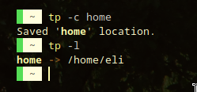

# The Teleport (tp) command!
This is an idea I wish some shell would implement. But I actually built a working prototype. Originally this was all coded in the fish shell programming language so it was exclusive to that shell (see old/ directory).

The idea of the command is to _"teleport"_ between saved locations in the file system. Let's say you're configuring your shell, whose config file is in some deep nested directory, like "/home/$USER/.config/fish/". After some time of tinkering with the options you are satisfied with the look and feel, you close all the instances you opened for debugging, you save and close the config file and you go on with your day. But, 30 minutes later, you realize you actually want an alias for a command you forgot to implement. Now you have to search for the path to the file again, type it and cd into it; this would be _ok_ if you had to do this, let's say, once a week or two. But since I'm always tinkering with the config files of a lot of programs myself, I usually end up doing this 8 or 10 times a day if I've just recently installed the program and it needs a lot of configuration. **The answer to this problem is the 'tp' command!**




Of course in that example tp doesn't make a lot of sense because you can simply go back to home doing "cd" but anyway, that's the idea.

## Usage
```
-- TP command - help message --

tp -l                   => list saved locations
tp -c {name} [path]     => create a new location with {name} and {path}, if no path is given, the working directory will be used
tp -r [saved_location]  => remove the specified location or the temporary if non are given
tp -p [location]        => print location instead of changing directory
tp -h                   => outputs help message

```

With the '-c' option you create a _"location"_. _Locations_ are directories you've saved and intend to revisit frequently. For example, we can type:

```tp -c fish /home/$USER/.config/fish ```

And that would save the path _"/home/$USER/.config/fish"_ into a location named 'fish'

Then we could run ```tp fish``` and instantly cd into the directory.

You can also have a fast glance of all saved locations or remove any location you don't need anymore with the other options.

One can run tp without arguments to save the working directory. And the next time you run tp without arguments you'll be _teleported_ to the previously saved directory. Useful to point new shells to the directory you are working on without having to manually copy the PWD. This is the function that motivated the creation of this prototype!

## Instalation
1. Git clone the repo ```git clone https://github.com/elicapo133/Teleport.git```
2. Compile 'tpbin' ```make```
3. Change the adapter script:
    * Where it says ```TP_BIN="/home/$USER/datos/GoProjects/Teleport/tpbin"```, put the path to the binary file.
Clone this directory and **edit the fish variable "TP_DIR"** to point to the root of the repo. Then, create a symbolic link in _fish/config.d_ or source it right from _config.fish_
4. Source it from your shell's config file:
 * fish: 
        - Add ```source path/to/adapter_script``` in the config file
        or
        - ```cd ~/.config/fish/conf.d/ && ln -s path/to/adapter_script"```
 * bash: Add this on your .bashrc ```source path/to/adapter_script```

## Conclusions
These were my conclusions originally, when it was first coded in fish:
> Believe me, I would've loved to do this in c, or perhaps, python. But since the working directory is part of the shell's state we can just change it from another process. So I was forced to write the program as a function in the shell's scripting language. This is the reason for the program not being available on other shells.
> 
> It was fun though! Excellent excuse to sit down and learn the fish programming language.

Now, I have refactored the code so that it can be ported to other shells. The idea is that, through the return value, the 'tpbin' binary (coded in go) tells the adapter shell script what is happening: 0 means the shell has to cd to whatever was printed to stdout, 1 means just print stdout the output of 'tpbin', 2 means print to stderr and return 1. This is somewhat hacky, I know, but that's the only solution I found that met the requirements. There are some advantages and some disadvantages in doing this:
### Pros
- Speed: go is much faster than scripting languages, and since we make go do the heavy lifting, the command is faster overall.
- Portability: coding things this way, we make tp portable to basically any computer, and the adapter shell scripts are trivial to code.
- Readability: go is much more readable than scripting languages (at least in my opinion).

### What we lost
- Colors! Such a shame! There's no sane way for the binary file to communicate to the shell script what parts have to be which color.
- Simplicity: the program is somewhat more complicated with the script adapting and so.

